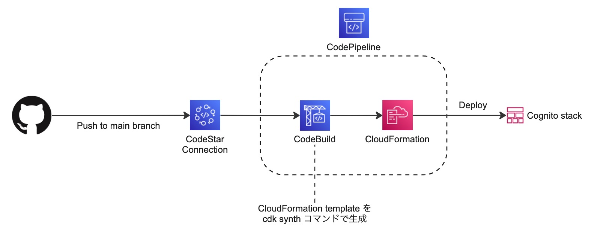
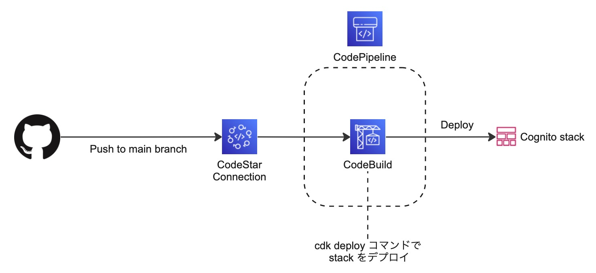
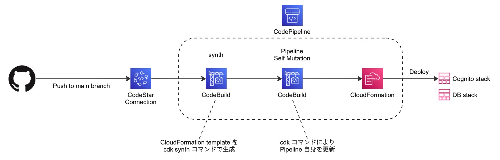
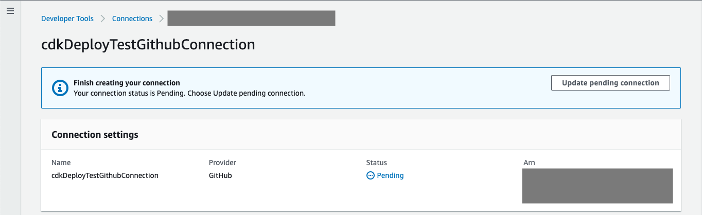

# cdk-deploy-from-pipeline

CDK を使って定義されたリソースを CodePipeline 上から AWS に自動デプロイするサンプルです。
以下の 3 パターンの Pipeline が定義されているため必要に応じて使い分けてください。

- Pipeline からのデプロイ時に CloudFormation を使うパターン

  

- Pipeline からのデプロイ時に cdk コマンドを使うパターン

  

- CDK の aws-cdk-lib.pipelines module を使ったパターン

  


## Pipeline のデプロイ

1. 動作させたいタイプを以下から選択して、CDK デプロイコマンド実行時に指定してください

    ```
    cdk deploy <STACK_NAME> -c githubOwnerName=<GitHub の Organization or User 名> -c githubRepoName=<GitHub Repository 名>
    ```

    | Stack name | Description |
    |--|--|
    | CfnDeploymentPipelineStack | デプロイに CloudFormation を利用 |
    | CdkCliDeploymentPipelineStack | デプロイに CDK コマンドを利用 |
    | CdkPipelinesDeploymentStack | CDK の pipelines module を使った CI/CD |

    ※ CdkPipelinesDeploymentStack については、Pipeline 自身を GitHub に保存されているコードに従って更新する処理が含まれているため、Pipeline のデプロイ前に GitHub に Pipeline 定義を Push しておく必要があります。

1. デプロイ後、AWS の Management Console から `CodePipeline` を選択して CodePipeline の一覧を表示します

1. `Settings` -> `Connections` の順番にメニューを遷移し、`Status` が Pending になっている Connection を選択して詳細を表示します

1. `Update pending connection` をクリックし、必要な設定を行い GitHub と接続します

    


## Pipeline のワークフロー起動

Pipeline をデプロイ時に指定した GitHub Repository の main ブランチに Push することでワークフローが起動されます


## 注意事項

- このサンプルでデプロイした AWS リソースを削除する場合、Pipeline からデプロイされる Stack (今回は CognitoStack) を Pipeline の Stack より先に削除してください。先に Pipeline の Stack を削除すると、Pipeline からデプロイされる Stack を削除する際に IAM Role に関連するエラーが出て Stack 削除が失敗する場合があります。
